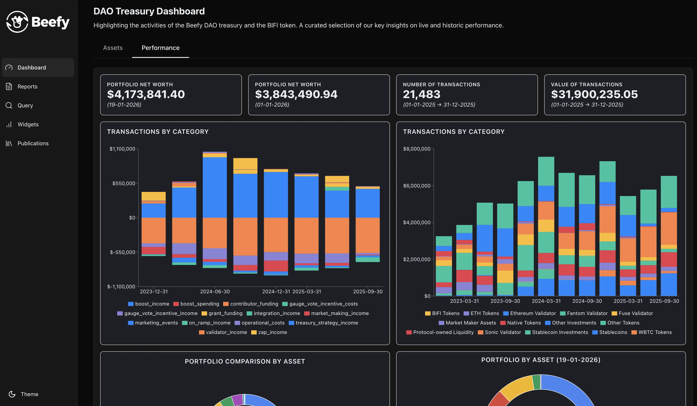
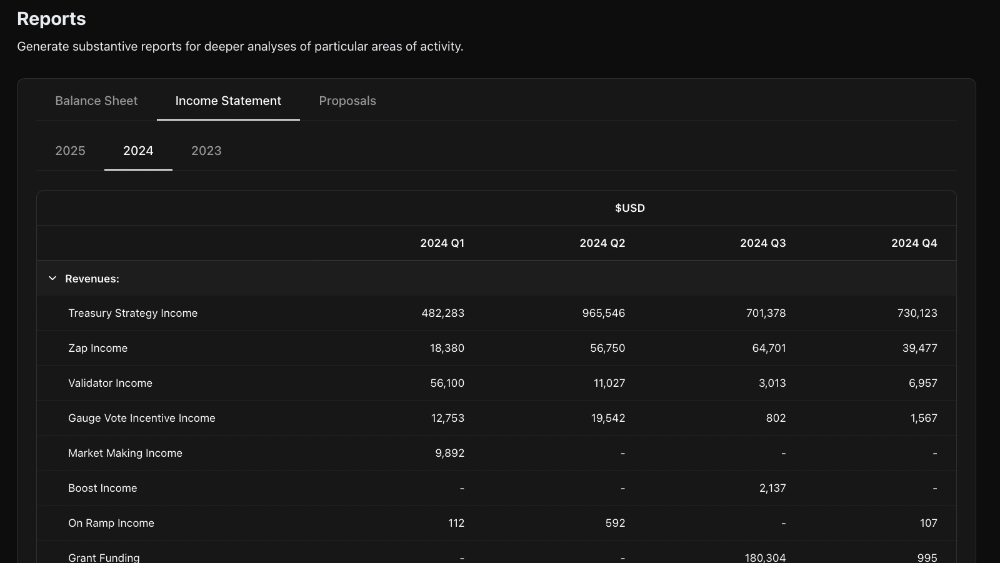
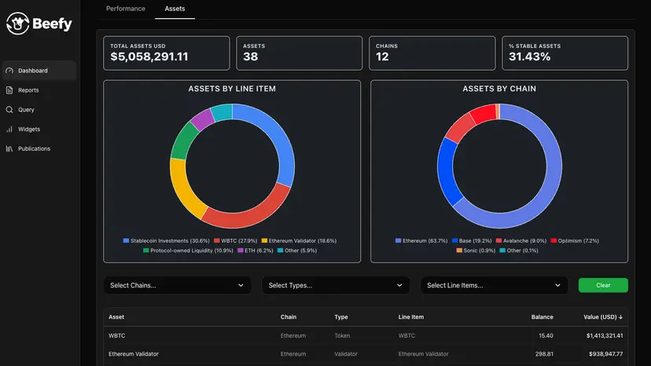

> This blog is a companion piece to the [Beefy article](https://beefy.com/articles/staworth-octav-financial-systems/) on new developments in 2025. It's a deep dive into building with Octav, and the technologies that comprise the new [Beefy Financial Hub](https://beefy.staworth.com/).

In January 2025, we [sought approval](https://snapshot.org/#/s:beefydao.eth/proposal/0x7293b09c56e80bf7b655e6eea2a7c913d8ff6d8c3ee470b9f90349d0b196ea0e) from the Beefy DAO to enter into a year-long engagement with [Octav](https://octav.fi/) — a leading provider of portfolio intelligence data. Our aim for the year was to improve and accelerate Beefy's accounting efforts by building better tooling. 

We chose Octav because, unlike most leading SaaS crypto accounting platforms, their team is developer-led and wants to build alongside their partners, not just onboard them to their monolithic service. 

Octav promised us better automations, open access to our data, and a rapidly-developing platform that we could help to shape. **They delivered on every count.**

12 months later, and we're extremely proud of everything that Beefy, Octav and Staworth accomplished in 2025: we unveiled our new [Beefy Financial Hub](https://beefy.staworth.com/) — a one-stop shop for data on Beefy's financial performance; we opened up [Beefy's transaction data](https://beefy.octav.fi/app/transactions) to the public; we made that data easily accessible to our community from Discord via an Octav bot; and, we've automated accounting for 90-95% of tens of thousands of annual transactions.

This article recaps the developer experience of building on Octav and the feature design for Beefy's new tools.

## The Octav Stack

From a brief glance, some may wrongly conclude that Octav is a mere portfolio tracking tool, competing with dozens of others in the industry.

It's true that Octav's web application provides industry-leading portfolio tracking and analysis across dozens of blockchains, competing with the likes of DeBank and Nansen. Peeling back a layer, the app's transaction-level data offers categorisation and user-editable fields, resembling leading crypto accounting subledger apps, like Tres and Cryptio. But under the hood, Octav is a burgeoning data giant that spans a range of verticals, like Dune, DefiLlama or CoinGecko. 

We think that Octav can be best understood as a combination of three core services:

* **Data collection, processing & distribution** - fetching, indexing and cleaning raw data across dozens of blockchains, then processing and distributing simplified, intelligible and accurate derivative data to clients. 

    * ***Octav helped Beefy** avoid hundreds of hours' work, extracting terabytes of data to keep track of treasury activities.*

* **Digital assets and DeFi position analysis** - identifying interactions with over 2 million digital assets and over 10,000 DeFi protocols from within their datasets, and then undertaking the complex process of identifying net asset balances, gathering prices for all relevant assets and discerning value, cost and gains for each position. 

    * ***For Beefy,** this means not only monitoring investments, but accounting for revenues, costs and profitability over tens of thousands of transactions annually.*

* **User-driven interfaces and applications** - transforming that generalised data and analysis into specific, actionable insights for users of every aptitude through elegant interfaces and applications. Building the tools to help users conduct their own specific analysis, whether for their internal command centres or their external transparency. 

    * ***Beefy relies on Octav** to maximise our internal understanding and control over the treasury, and to help disseminate Beefy's data to our users and the market.*

The *"Octav Stack"* is the combination of technologies that together deliver these services:

| Layer | Accessibility | Description |
| ----- | ------------- | ----------- |
| Infrastructure | Closed | The nodes, execution clients, indexers and other infrastructure needed to extract, process, and refine data across Octav's dozens of blockchains. |
| Database | Closed; Accessible Data | The storage and organisation of Octav's refined data, both to power Octav's apps and for user access. |
| API | Open User Access | The web services for accessing, amending and distributing user data from the database, empowering users to integrate Octav into their own systems. |
| Web App | Open User Access | The face of Octav which contains the heavy and standardised applications for analysing portfolios and accounting for transactions.  |
| Widgets | Open User Access; User Submissions | Miniature applications within the Web App that the user can customise, or even build and share, positioning the app as both a platform and a product. |

Historically, Octav has always been set apart by its open approach to technology, which embraces builders and ensures users can own their own data. But in 2025, two fundamental changes took their model to the next level:

* First, Octav completed the move to **an API-native model**, where all the user data that's available in their app would be open to users directly through a powerful API service. By offering a full range of [flexible endpoints](https://docs.octav.fi/api/introduction#core-endpoints) with deep configuration options, Octav has empowered external applications to extract the data they need. In short: Octav opened its backend up to builders.

* Second, Octav launched its **V2 web application**, which introduced a modular approach to interface design where users build their own workspace using *"widgets"*. These miniature applications are entirely customisable derivatives of Octav's data. Users can even create their own widgets and submit them to Octav's public widget marketplace. In other words: Octav opened its frontend up to builders.

With the stack now complete — and completely open — Octav is ready to bring together its own community of developers and builders looking to apply their DeFi data in new ways.

## The Hub

With that spirit in mind, we — together with contributors to Beefy — [entered a team](https://ethglobal.com/showcase/habeas-data-vgmcd) into the ETHGlobal Buenos Aires Hackathon in November 2025 and won first prize in Octav's Best Widget award.

The project was modelled on Beefy's own needs: since the start of 2023, we have helped Beefy to prepare and publish [routine quarterly financial reports](https://beefy.com/articles/tag/financial/) of aggregate performance data. Octav powers these reports, but preparing and distributing them was still a sizeable operation on top of Octav's existing tools. 

Our goal for the hackathon was to turn these processes into a public-facing application built on Octav’s API, capable of applying our accounting methods to both live and historical data. Put simply, we set out to move **from static reports to real-time reporting**.

The culmination of that vision is the [Beefy Financial Hub](https://beefy.staworth.com/).

The Hub brings together the structure of our formal accounts with customisable enquiries into the meaning of our data, all powered by Octav's API.

On the one hand, it serves [Reports](https://beefy.staworth.com/reports) (screenshot above), which detail aggregate figures across Beefy's financial statements and areas like costs for individual governance proposals. Reports use fixed designs aligned with Beefy's accounting standards, but the Hub brings them to life with Octav's live data and Beefy's full historical data.

On the other hand, it implements [Query](https://beefy.staworth.com/query) functionality (gif below), letting users select, arrange and display data from Beefy's Octav instance to suit their own needs. Users can request raw data, tables or Octav-compatible widgets, all of which can be downloaded.

The full library of possible [Widgets](https://beefy.staworth.com/widget) is also displayed for perusal.

Bringing the two together, the heart of the Hub is the [Dashboard](https://beefy.staworth.com/dashboard) (screenshot below), where a growing selection of widgets, analytics and descriptions paint a picture of performance for Beefy's users, tokenholders, prospective investors and the industry at large. Where our existing financial reports retell the story of Beefy's performance each quarter, the Dashboard is a living theatre to watch it unfold.

 

Through this range of tools, we aim for Beefy's Financial Hub to become the Swiss Army knife for tokenholders and users assessing the health and performance of Beefy. It's a one-stop shop to understand Beefy's value proposition.

## Distribution Channels

Opening up Beefy's Octav data to the public introduces a range of different use cases and functionalities. Ultimately, the goal is to make access to Beefy's financial performance data easier and faster for all conceivable interested parties.

Capitalising on this new opportunity, we felt the perfect distribution channel for Beefy would be via Beefy's popular Discord server. Beefy boasts one of the best attended and managed Discord spaces within DeFi, with a constant footfall of users and tokenholders new and old. It also hosts a fleet of Discord bots used for all manner of common interactions and requests. Within the Beefy community, no one is shy of Discord Bots.

The Octav bot that we developed hosts a range of simple commands which pull, aggregate and return Octav data in standardised reporting forms. It allows Beefy's contributors to check on their aggregate revenues or costs over any arbitrary period on any specific chains, taking a snapshot of profitability in a few seconds. It also enables historic cross-checks of portfolio balances, understanding how the DAO's treasury has evolved over time.

Though Discord was a natural choice for Beefy's community, the same distribution tools can easily be replicated across Telegram, Slack, and other popular collaboration spaces. With the advances of LLM-powered bots, it's not hard to imagine integrations with social media platforms, where bot accounts provide answers to the public's questions with references to live portfolio and transaction data.

In 2026, having your data grounded within your supplier's platform is simply unacceptable. 

For distribution with Octav, **the sky is the limit.**

## Looking Ahead

As we move into a new year, our achievements to date haven't dulled our ambitions. If anything, the rate of progress within the Octav Stack has only served to expand our view of what's possible in 2026.

With Beefy's Financial Hub live and operational, we've barely begun to scratch the surface of the different kinds of widget designs and implementations that we would like to see. By continuing to work closely with Octav, building on their stack and aligning our development paths, we aim to showcase the limitless potential of DeFi to improve our financial systems.

**We're just getting started...**

---
**Learn More:**

| [Beefy Financial Hub](https://beefy.staworth.com/) | [Octav API Documentation](https://docs.octav.fi/api) | [Beefy 2025 Article](https://beefy.com/articles/staworth-octav-financial-systems/) |
| - | - | - |
