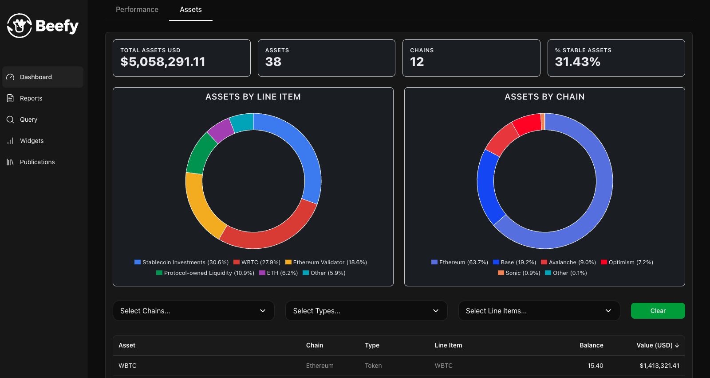

<!--  -->

> *This blog is a companion to the [Beefy article](https://beefy.com/articles/staworth-octav-financial-systems/) on building with Octav. It's intended as a deeper dive into the systems behind the Financial Hub, and the process of building with the Octav Stack.*

# Building Financial Systems: Beefy x Octav x Staworth

In January 2025, we [sought approval](https://snapshot.org/#/s:beefydao.eth/proposal/0x7293b09c56e80bf7b655e6eea2a7c913d8ff6d8c3ee470b9f90349d0b196ea0e) from the Beefy DAO to enter into a year-long engagement with Octav — a leading provider of portfolio intelligence data — aimed at improving and accelerating Beefy's accounting efforts.

12 months later, and we're proud of all that we accomplished together in 2025. 

## The Octav Stack

## Introducing: The Hub

## Distribution Channels

# Looking Ahead

As we move into a new year, we're delighted to 