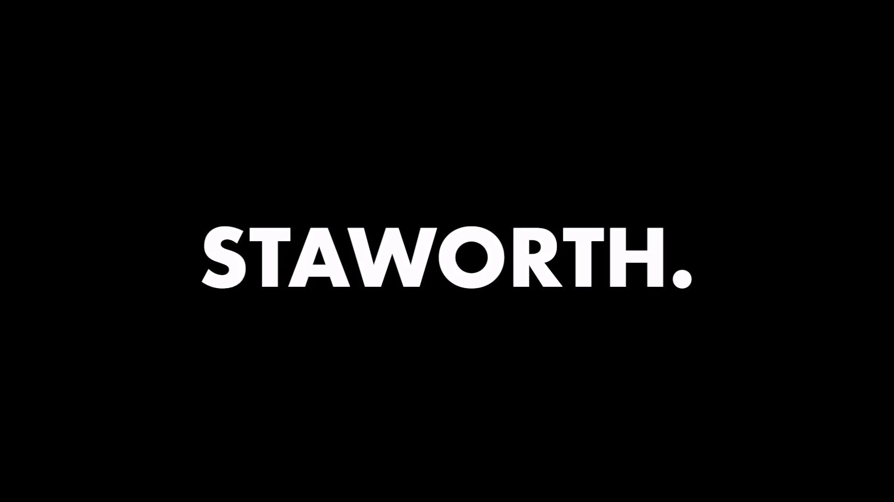

> This updated article is derived from the original [Paragraph piece](https://paragraph.com/@staworth/introducing-staworth) published on 31 May 2024. Minor updates have been introduced to improve web accessibility via [staworth.com](https://staworth.com/).

Setting out on your own is tough. The fear and doubt that surround breaking with everything you've ever known to do something completely different can be very real, and very hard to grapple with. I'm not ashamed to say it's taken me years to gradually wrestle my doubt into submission, and take the plunge to make my own adventure.

A key part of this struggle is that it's difficult to talk to people about why you want to walk away. There's a stigma around confessing dreams of escape because it casts doubts over your loyalty and commitment; it threatens to decouple you from the pack. People may ask what you're doing and why, but - to the extent that it's radically different to them - it can often feel like an affront to their own choices and path. At times, I’ve come to dread these questions.

But these questions are important. If you're going to bring about some real change in the world, eventually you will need to make friends and influence people. Without being able to tell people the story of who you are and what you came for, you will always be a stranger that’s difficult to trust.

So, this article is an attempt to answer these questions: who and why is [Staworth](https://www.staworth.com/)?

But before we turn those questions, let me first set some context around why I - a skilled professional service provider, in the midst of building a comfortable career and life for myself - felt the need to break out on my own.

## Value Alignment

The difficulty with professional services is well known. Economists call it the "principal-agent" problem: appointing someone else to act on behalf of your interests only works where that agent's interests do not conflict with or diverge from your own. For instance, when a barber is asked if their customer should get a haircut there's a natural temptation to find reasons because the barber will also get paid. That's not to say that you should never get a haircut from a barber, but more that you want to be careful who you let influence your decisions.

The barber example is pretty low-risk, and likely wouldn't worry most people. However, the concern is exponentially exacerbated as the value involved increases. At the peaks of our economic geography, there are enormous decisions to be made on policy, corporate strategy and legal disputes that can cause generational shockwaves. I’m sure we’ve all at some stage felt the frustration when realising that our politicians, consultants or lawyers have influenced those marginal decisions towards their own interests. Everyone should be concerned about who advises them on big-picture and high-value decisions. Value alignment is critical.

For me, seeing over and over again how professional service providers are driven to discretely prioritise their own interests whilst leading their clients away from theirs has left me with a level of existential "ick". Though there is some strong value alignment to be found in professional services, in my experience instances of the principal-agent problem are far more common. It's so common in fact that it’s often rare to find a senior professional service provider who hasn't made their peace with some perversion of interests, and stopped asking themselves these hard questions. At times, the problem feels like an elephant in the room that everyone knows but no one can talk about.

In theory, the solution to the principal-agent problem isn’t hard: each organisation should seek to maximise the value alignment between their key experts or advisors and decision-makers. But achieving this in practice is much more difficult.

But there are solutions available. Organisations can deploy financial incentives to tie agents to its interests. They can try to imbue a culture which has significant intangible value and attraction. They can even try to groom agents with close personal ties and mutual interest in their own locality. Or - as I've come to prefer - you can look to equity to create value alignment through shared ownership.

## Equity

Though “equity” has many definitions, I like to combine the two most common together and describe it as a "fair share". Where the term is used to refer to the ownership of a company, it’s typically always in the context of multiple shares of ownership, and has the quality of allocating what fairly belongs to who. Though perversions of the concept have been misappropriated for financial fraud and harm (the very antithesis of fairness), I believe that at its purest the definition of equity refers inherently to fairness.

How does equity help with value alignment? Well, it's not a perfect, automatic, catch-all solution. It would be naive to assume you can just give your agent a single share and have them neutrally look after your interests. Equity is merely a tool that captures a unit of self-interest and allows for that unit to be transferred and manipulated. It permits organisations the opportunity to build an enticing framework for joint ownership and create maximal value alignment among its participants.

At this stage, onlookers can and have jumped to the conclusion that shared ownership simply means getting everyone under the same roof and giving them each a key. Much like the single-share agent above, these simplified conclusions fail to handle the complexity of the principal-agent problem. For instance, compare the owner whose small share is most of their worth, with those whose large shares are a small portion of their portfolio. Equity is not just about a fair share of the organisation; it needs to be a mutual exchange of shares in one another's future potential.

One of my favourite examples of an enticing equity framework is how Toyota conquered automotive supply chains with what’s come to be known as ["lean production"](https://en.wikipedia.org/wiki/The_Machine_That_Changed_the_World_(book)). Senior management at Toyota realised that bringing suppliers within their own control could breed complacency; the humble spark plug manufacturer would often struggle to realise their individual potential and opportunity amidst the whole vehicle. Instead, Toyota sought to tightly couple each link in their supply chain with their own opportunities and incentives, whilst unifying them all around a common goal of leanness. By encouraging suppliers to operate their own businesses and generate their own profits, exchanging equity between Toyota and its suppliers, and insisting on long-term commitments and vested interests, Toyota produced a system that gave rise to unprecedented levels of quality and performance from every link in the chain.

Again, it would be an oversimplification to assume that you can "Toyota-rise" any organisation. The point is that equity commoditises shared ownership, forming the basic raw material from which an exceptional, value-aligned organisation can be forged.

But don't professional service companies have their own equity? Can't that be used to tackle the principle-agent problem? And so is it not just a problem of circumstance, rather than a legitimate grievance with the way things are done? Maybe so. However, in my experience, grappling with this problem within my industry provided few decent solutions. Instead, I felt I had to start looking outside to find my own way forwards.

## Web 3.0

In my quest for answers to that deep existential ick, I’ve been lucky to find myself at the right place and time to witness the rise of a technology that will help. Stumbling onto Web 3.0 - the decentralised internet - was a lucky coincidence. But the potential of Web 3.0 to evolve humanity's techniques for value alignment is no accident.

At first, most commentators will wonder why decentralization makes a difference. Take the Toyota example, where a single centralized entity rose to a dominance in part by building a strong onchain equity framework. If Toyota hadn't had the scale to entice skilled suppliers, exchange valuable equity and offer long-term commitment, would any supplier have given them the time of day? This is undoubtedly the case in a capital-heavy industry like manufacturing, where the high cost of entry means that some level of resource centralisation is a prerequisite to building a competitive product. I am under no illusions that decentralisation is the solution to the principal-agent problem.

However, the world economy is constantly evolving, and a greater proportion of humans are devoting their working lives to social, cultural or informational roles. Advanced automation and production techniques continue to whittle down the remaining share of skilled labourers. And AI threatens to once again shake up the order of labour. In a market where a lone worker can compete squarely with enormous organisations in providing professional services, creating cultural value or building damn-good software, isn't the opposite conclusion more likely: if an individual can profitably break off from a company to focus more on their own interests, doesn't the principle-agent problem suggest that they often will?

The world has been progressively decentralising for a long time now. Really, the emergence of the internet has already brought about the decentralisation of information, and has radically changed every industry and market on Earth. So when I say Web 3.0, really I mean the decentralisation of consensus - the opportunity for any information to be verifiable by a world of private, self-interested individuals in a way that can't be censored or corrupted. This allows services formerly built around trust to be constructed in a trustless fashion. It allows for finance, law and economics to be embedded within the internet, rather than merely scaffolded around it. And - I believe - it will force many of these industries to decentralise further, uprooting the status quo.

Does decentralised consensus really solve the principal-agent problem? Not directly. But it facilitates both the granular fragmentation of separate interests and the explicit representation of self-interest, both of which make the assessment of value alignment far easier. It also empowers principals to seek a decentralised source of truth and advice, to counterbalance against its agents. Ultimately, the tools emerging from this burgeoning industry present opportunities to tackle with this problem.

Web 3.0 is also the perfect place to experiment with equity. Tokenisation on the blockchain allows for greater flexibility in designing shared ownership frameworks. Onchain equity can accrue in real time, be structured, allocated or committed in any conceivable shape or form, and boast the security of decentralised validation. Not only does decentralisation empower more individuals to operate their own businesses (much like in Toyota's lean supply chain), it also more easily enables those businesses to better achieve value alignment. Equity is created anew in Web 3.0.

## Staworth

In a very roundabout way, that brings us back to Staworth.

The name "Staworth" is derived from the old English term "Stalworth", which evolved into the modern term "Stalwart". Among its different definitions, it means a loyal, hardworking and reliable supporter, something that's strong or sturdily built, or an unwavering partisan dedicated to a particular cause. For ease, the pronunciation of Staworth is altered to "stay-worth", a constant reminder of our dedication to sustaining value alignment through fair shares of ownerships. All of these words and concepts match closely with the ideas and principles that I wanted to see in a modern, value-aligned Web 3.0 business.

Staworth has its own profit mandate, it's own equity structure and its own potential for shared ownership. The goal then is to amend the tired formula for professional services and tackle the principle-agent problem head on, using all the tools that Web 3.0 has at its disposal. By providing professional services to Web 3.0 native organisations - who are well versed and keen to experiment - Staworth has the potential to build a novel and stronger system of shared ownership, with value alignment as the unifying goal.

*How will we do this?* Simple. Staworth will be a public contributor to and active member of decentralised communities. It will selfishly look to identify opportunities to create value and develop organisations to better serve the goals of their communities, in exchange for payment from their earnings, assets or equity. And a portion of all Staworth's earnings will be reinvested or held in the equity of those communities, specifically in the form of governance tokens - the modern onchain equity of Web 3.0. Staworth will be a hardworking and reliable supporter of its communities, participating diligently in their governance and seeking always to align around its unwavering dedication to decentralisation. And over time, as the equity earned and held by Staworth outstrips it immediate earning potential, the balance of Staworth's own interests will be tipped firmly in the direction of the communities that it participates in...

So, that's [Staworth](https://www.staworth.com/). A Web 3.0 professional services firm, dedicated to staunch advocacy for digital communities.

Our mission is to achieve a better value alignment through and within the decentralisation revolution.

If you, the reader, feel your own alignment with these values, don't hesitate to get in touch with [{{CONTACT_TO_EMAIL}}](mailto:{{CONTACT_TO_EMAIL}}).

I look forward to finding out where this brave new path takes us.
